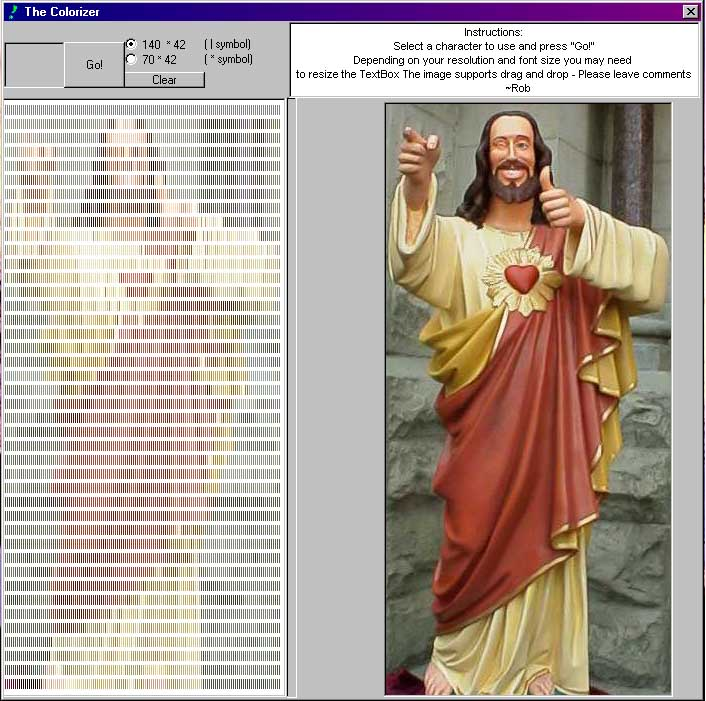



## Text Pictures

### Description

I had a very different idea of this program when I started but this is just as cool. It takes any image file (gif, jpeg, bmp) and converts it to text. I've tested it with Arial. You can enter a custom text pattern but you'll have to do a little bit of extra programming. Please leave comments. Thanks ~rob
 
### More Info
 

             |
---                |---
**Submitted On**   |2002-05-06 21:30:46
**By**             |[Rob H](https://github.com/Planet-Source-Code/PSCIndex/blob/master/ByAuthor/rob-h.md)
**Level**          |Beginner
**User Rating**    |5.0 (20 globes from 4 users)
**Compatibility**  |VB 5\.0, VB 6\.0
**Category**       |[Graphics](https://github.com/Planet-Source-Code/PSCIndex/blob/master/ByCategory/graphics__1-46.md)
**World**          |[Visual Basic](https://github.com/Planet-Source-Code/PSCIndex/blob/master/ByWorld/visual-basic.md)
**Archive File**   |[Text\_Pictu80556572002\.zip](https://github.com/Planet-Source-Code/rob-h-text-pictures__1-34544/archive/master.zip)

